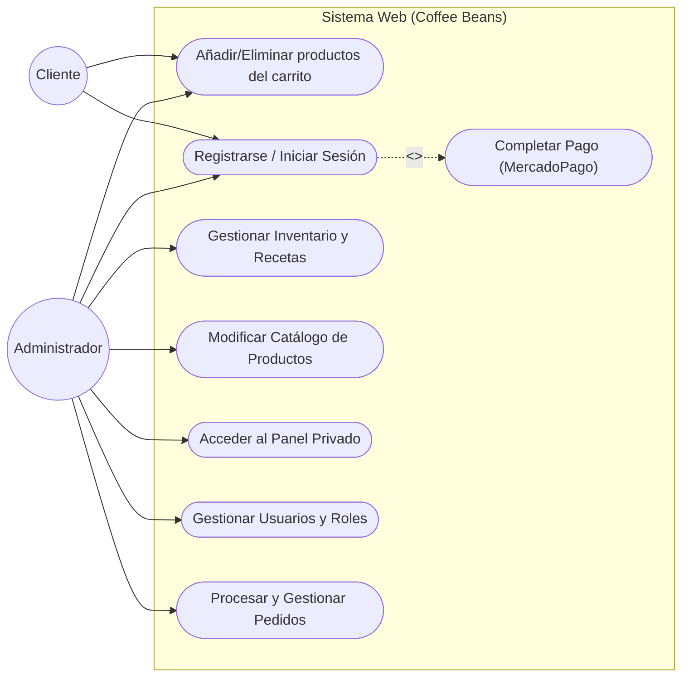
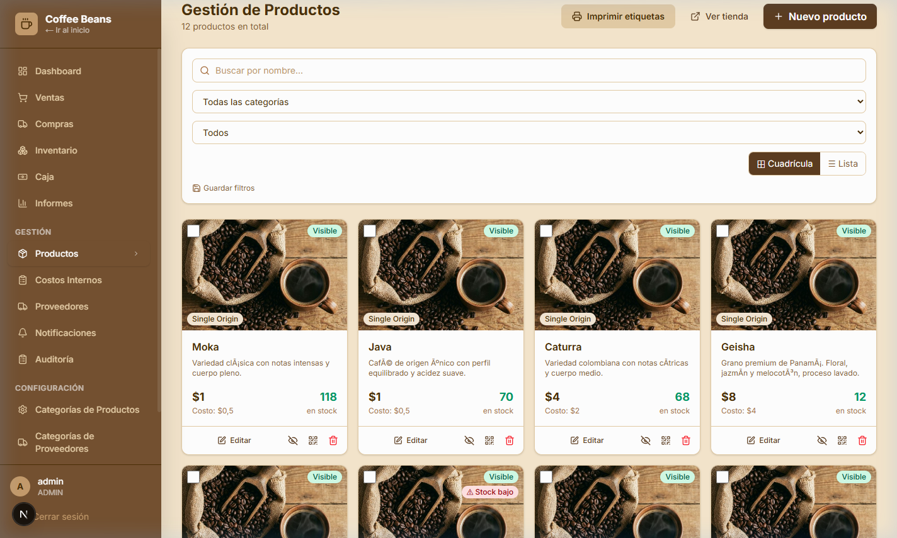
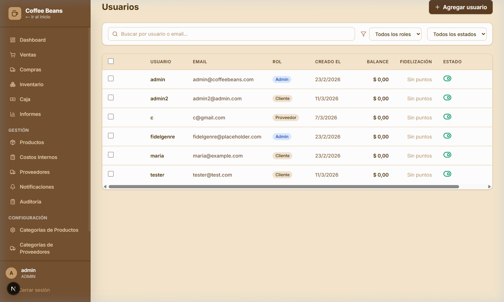
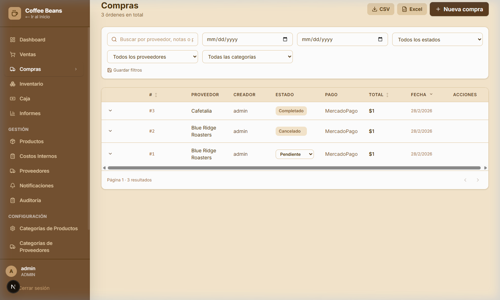
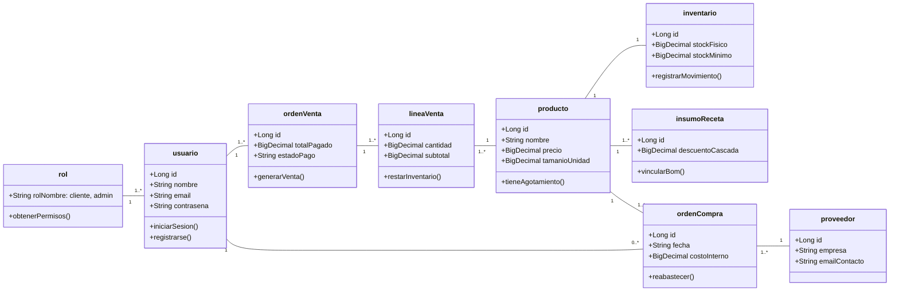
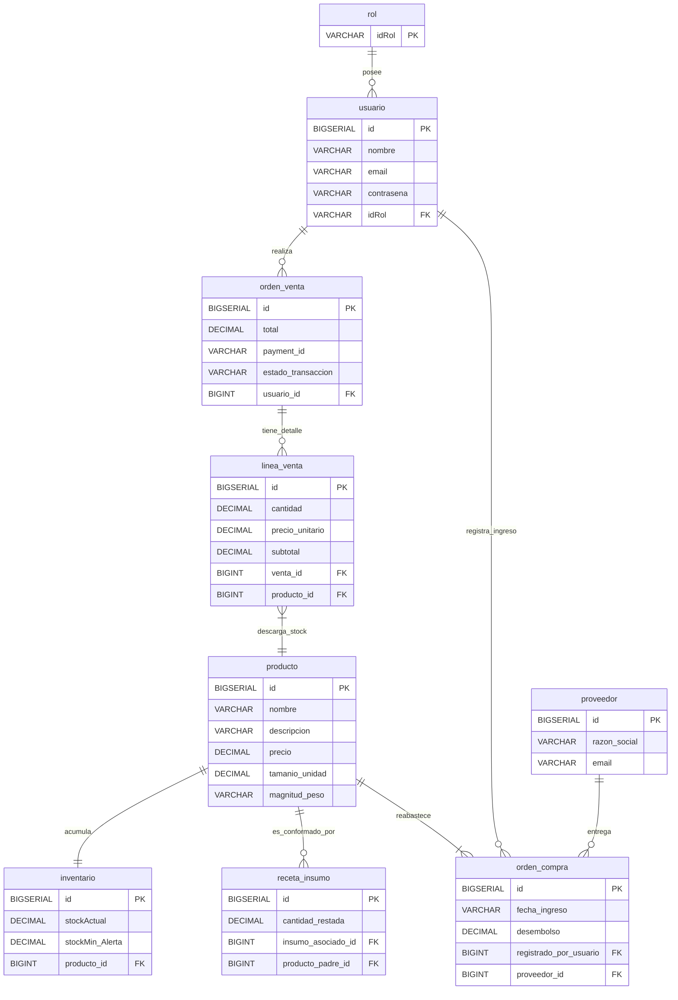

# Coffee Beans - Proyecto de Desarrollo Web
**Fecha de presentación:** 18/08/2025
**Integrantes:** Fidel Genrebert – Francisco Guerin

## 1. Informe Preliminar del Proyecto

### Situación Actual
Actualmente, la empresa simulada carece de presencia digital. Toda la información corporativa y la gestión de pedidos se realizan a través de procesos tradicionales, como órdenes en papel en el local físico y llamadas telefónicas para coordinar ventas o servicios de delivery. Este modelo limita la visibilidad de la marca, reduce el alcance a nuevos clientes y dificulta la interacción eficiente con los consumidores. Asimismo, la falta de una plataforma en línea impide que los usuarios puedan consultar productos, conocer la identidad corporativa o realizar compras de manera remota.

### Objetivo General
Desarrollar una aplicación web funcional, moderna y atractiva para la empresa simulada de producción y comercialización de café, "Coffee Beans", con el fin de mejorar su presencia en línea, reflejar su identidad corporativa y ofrecer una experiencia de usuario que simule un entorno de comercio electrónico completo.

### Objetivos Específicos
- Diseñar una interfaz intuitiva y estéticamente coherente con la temática del café y la identidad de la empresa.
- Implementar un catálogo de productos y un carrito de compras funcional para los usuarios.
- Desarrollar un sistema de registro e inicio de sesión de clientes y administradores.
- Proveer una sección “Quiénes Somos” con información institucional.
- Implementar un sistema de contacto que permita a los usuarios enviar consultas, sugerencias o reclamos.
- Permitir a los usuarios seleccionar métodos de entrega y registrar la información en el sistema.
- Integrar un sistema de pagos online seguro (MercadoPago) para procesar transacciones.
- Implementar un sistema de gestión interna (Panel de Administración) para control de inventario, recetas de productos (BOM), compras a proveedores y flujos de caja.

### Alcance
El desarrollo de la página web estará orientado en primera instancia a fortalecer la presencia digital de la empresa a nivel nacional, abarcando desde la cara visible para el cliente (Storefront) hasta la gestión interna del negocio (Backoffice). El sistema posee arquitectura escalable, permitiendo su adaptación y expansión futura.

### Requerimientos Funcionales
- **Autenticación**: Registro e inicio de sesión de usuarios con roles definidos (Cliente, Administrador).
- **Catálogo y Carrito**: Visualización detallada de productos, manejo de carrito protegido y cálculos exactos del total de la compra.
- **Gestión de Pedidos y Pagos**: Checkout integrado con MercadoPago, registro de ventas (Sale Orders) y trazabilidad completa del ciclo de compra.
- **Panel de Administración**: 
  - Gestión de inventario avanzado (múltiples unidades de medida, stock mínimo).
  - Gestión de Recetas (BOM): Deducción en cascada de insumos según componentes configurados en los productos finales (ej. descontar bolsas, gramos de café).
  - Registro de compras a proveedores y control de caja centralizado (Cash Register).
- **Módulo de Contacto**: Formulario para consultas y reclamos integrado en el ecosistema.
- **Diseño Responsivo**: Adaptación total a dispositivos móviles y de escritorio.

### Requerimientos No Funcionales
- **Usabilidad**: Interfaz accesible y moderna adaptada al sector gastronómico especializado.
- **Rendimiento y Tolerancia a Fallos**: Carga rápida del catálogo y transacciones atómicas en la base de datos para prevenir cualquier inconsistencia de stock.
- **Seguridad**: Contraseñas encriptadas mediante algoritmo BCrypt, uso de JWT (Json Web Tokens) para validar el estado de las sesiones, protección de rutas y endpoints exclusivos de administrador.
- **Tecnologías Empleadas**:
  - **Frontend**: Next.js (React), TypeScript, Tailwind CSS, Lucide Icons.
  - **Backend**: Java 17, Spring Boot, Spring Security, Hibernate (JPA API).
  - **Base de Datos**: PostgreSQL para un robusto almacenamiento de datos relacional.

---

## 2. Documentación de Diseño y Soporte

### 2.1. Diagrama de Casos de Uso



*(Nota: El diagrama expone los casos de uso originales integrando pasarelas del entorno desarrollado para el checkout).*

### 2.2. Especificación de Casos de Uso Principales e Interfaces

Este apartado detalla los procesos críticos del negocio vinculándolos con su implementación visual y lógica desarrollada.

#### CU01: Gestión de Venta Manual (Administrador)
*   **Actor:** Administrador
*   **Descripción:** Registro de ventas físicas en el local con validación de stock en tiempo real y filtro de clientes activos.
*   **Flujo principal:**
    1. El administrador abre el modal de "Nueva Venta".
    2. Selecciona los productos y ajusta las cantidades (el sistema valida stock inmediatamente).
    3. Selecciona un cliente de la lista de usuarios activos.
    4. Confirma la venta y se genera el recibo, descontando el stock.
*   **Alternativo:**
    - **Stock insuficiente:** El sistema impide superar la cantidad disponible y muestra un aviso visual.
    - **Cliente inactivo:** Los usuarios desactivados no aparecen en la lista de selección.
*   **Interfaz:**


#### CU02: Administración de Catálogo y Recetas (BOM)
*   **Actor:** Administrador
*   **Descripción:** Gestión centralizada de productos e insumos con filtros avanzados.
*   **Flujo principal:**
    1. El administrador accede al listado de productos.
    2. Aplica filtros (ej. por Categoría o Proveedor) para localizar ítems.
    3. Edita el producto: modifica nombre, imagen, precio o visibilidad.
    4. Guarda los cambios para actualizar el catálogo público.
*   **Alternativo:**
    - **Campos vacíos:** El sistema resalta los campos obligatorios y bloquea el guardado.
    - **Ocultar producto:** Permite retirar un producto de la tienda sin eliminar sus datos.
*   **Interfaz:**


#### CU03: Control de Inventario Auditado
*   **Actor:** Administrador
*   **Descripción:** Monitoreo de niveles de stock y ajustes manuales obligatorios.
*   **Flujo principal:**
    1. El administrador visualiza la tabla de inventario con alertas de stock mínimo.
    2. Selecciona un producto para realizar un ajuste (entrada o salida).
    3. Ingresa la cantidad y el motivo del movimiento.
    4. El sistema registra el movimiento con marca de tiempo y usuario responsable.
*   **Alternativo:**
    - **Stock Crítico:** Los productos por debajo del límite se resaltan en rojo.
*   **Interfaz:**


#### CU04: CRM y Gestión de Usuarios
*   **Actor:** Administrador
*   **Descripción:** Administración de perfiles de usuarios con control de acceso basado en roles y estados.
*   **Flujo principal:**
    1. El administrador accede al listado de usuarios.
    2. Visualiza datos de fidelización (puntos) y balance.
    3. Cambia el estado (Desactivar/Activar) o el rol del usuario.
*   **Alternativo:**
    - **Saldo pendiente:** No se permite desactivar usuarios con deudas en cuenta corriente.
*   **Interfaz:**


#### CU05: Venta Online y Checkout (MercadoPago)
*   **Actor:** Cliente
*   **Descripción:** Flujo de compra completo en el Storefront, desde la selección en catálogo hasta la transacción segura a través de la pasarela de MercadoPago.
*   **Interfaces:**
````carousel

<!-- slide -->

````

#### CU06: Gestión de Compras e Insumos (Administrador)
*   **Actor:** Administrador
*   **Descripción:** Registro y seguimiento de órdenes de compra a proveedores de café verde e insumos.
*   **Flujo principal:**
    1. El administrador inicia una "Nueva Compra" seleccionando el proveedor.
    2. Ingresa los ítems adquiridos, sus costos y cantidades.
    3. Confirma la recepción, lo cual actualiza automáticamente el stock del almacén.
*   **Alternativo:**
    - **Orden Pendiente:** Las compras pueden guardarse como "Pendiente" hasta que se confirme la recepción física del producto.
*   **Interfaz:**


### 2.3. Diagrama de Clases (Arquitectura Backend Central)



### 2.4. Diagrama de Implementación de Tablas (Modelo de Datos Físico/DER)



### 2.5. Documentación de Pruebas y Validación (Checklist PDF)

El sistema requirió a lo largo de su integración y estabilización, los siguientes escenarios de control de calidad documentados:

1. **Caso: Autenticación con Token (JWT Seguridad)**
   - **Acción del QA**: Creación de usuario administrador mediante interceptación manual de API (POST) y validación de rutas privadas.
   - **Resultado Esperado**: Protección persistente de endpoints. Sin el header "Authorization: Bearer [token]", cualquier solicitud al ecosistema `api/admin/*` debe ser bloqueada con Status 403 Forbidden.
   - **Estado Actual**: **Aprobado**. Las capas de filtros lógicos de Spring Security aprueban el token únicamente si fue firmado con el secreto local.

2. **Caso: Integridad del Carrito - Limitantes de Stock / Tipos de Unidad**
   - **Acción del QA**: Intento de compra de producto con stock 2 agregando 10 unidades al carrito.
   - **Resultado Esperado**: El sistema debe impedir el checkout y notificar el límite disponible según la unidad (ej. "Solo quedan 2 cajas").
   - **Estado Actual**: **Aprobado**. El servicio de stock valida en backend antes de procesar el pago.

---

---
   - **Historia**: Requeríamos impedir a usuarios malintencionados o al mismo UI, generar carritos superiores al inventario limitante (ej. solicitar 50 bolsas cuando solo quedan 2), como a su vez lidiar correctamente con transacciones sin alterar el *monto real* de manera exponencial según los gramos.
   - **Modificación**: Se limitó por estricta directriz de pasos intermedios (step) la modificación manual a "cantidades enteras" en el Frontend.
   - **Resultado Esperado**: Ventas exclusivas de bolsas finalizadas sin decimales ambiguos de compra para el consumidor, previniendo sobrefacturaciones erróneas.
   - **Estado Actual**: **Aprobado**. El frontend impide la inserción errática (ej. 0.1 bolsas) corrigiéndolo al entero base más cercano e inhibiendo sumar items arriba del stock maestro.

3. **Caso: Transaccionalidad de Componentes Hijos de Receta (BOM)**
   - **Historia**: Validar la consistencia íntegra del `ItemComponent`.
   - **Desarrollo**: Interacción comercial ejecutada para un "Item A" conformado por "Item B y C".
   - **Auditoría**: Se inspeccionó en el panel visualizador de *`StockMovement`* si ambos Item B e Item C fueron reducidos conforme la suma de la venta maestra de "Item A" por sus respectivas tasas de deducción multiplicadas por el `unitSize` subyacente de control de kilos.
   - **Estado Actual**: **Aprobado**. 

---

## 3. Informe Tecnológico

El proyecto experimentó una migración de su pauta de tecnologías teóricas a implementaciones finales empresariales optimizadas a fin de asegurar tanto escalabilidad vertical como horizontal ante demandas reales, resultando en:

- **Frontend Arquitectura React/Next**: 
  Se empleó **Next.js** impulsando React con el poderoso supra-lenguaje **TypeScript**. Abarcando un sistema altamente reactivo de estado donde variables del carrito, validaciones interactivas, y visualizaciones del catálogo actualizan de manera asíncrona la vista (Virtual-DOM) al instante de las llamadas REST a la API sin recargar la página. Para el estilado de impacto visual limpio, se aplicó íntegramente la utilidad atómica de **Tailwind CSS**.

- **Backend Enterprise**:
  En lugar del enfoque inicial propuesto basado en Node.js, para un proyecto que contempla transacciones financieras, control estricto relacional y requerimientos de seguridad bancarios; fue natural inclinar el desarrollo hacia **Java 17** bajo la tutela del Framework **Spring Boot**. Spring sirvió como un núcleo con Inversión de Control. Proveyó rutinas transaccionales fiables (vía `@Transactional`) esenciales para garantizar que si un movimiento de stock colisiona o la pasarela de pago responde fallos, ningún ítem en la base de datos sea debitado en un estado intermedio (Principio de Aislamiento ACID).

- **Gestión de Sesiones Seguras y Capacidad a Pruebas de Ciberataque**:
  Validación mediante cifrado fuerte (`BCrypt`). Descartamos gestiones de sesión propensas a interceptores vía inyecciones XSS tradicionales, adoptando el estándar global de **Autenticación sin Estado basado en Json Web Tokens (JWT)** que firman e incluyen los privilegios de los usuarios (`Roles`) para las aprobaciones de Spring Security MVC en tiempo de procesamiento.

- **Base de Datos Unificada**:
  Las interacciones fueron integradas nativamente mapeadas con la interfaz de persistencia Java (JPA / Hibernate) directo al motor transaccional de uso libre más poderoso mundialmente: **PostgreSQL**. Permitiendo una arquitectura en la nube escalable para la centralización unívoca de usuarios, recetas de componentes e información financiera.
