# Coffee Beans - Proyecto de Desarrollo Web
**Fecha de presentación:** 18/08/2025
**Integrantes:** Fidel Genrebert – Francisco Guerin

## 1. Informe Preliminar del Proyecto de Desarrollo Web
**Empresa Simulada – Producción y Comercialización de Café**

### Situación Actual
Actualmente, la empresa simulada carece de presencia digital. Toda la información corporativa y la gestión de pedidos se realizan a través de procesos tradicionales, como órdenes en papel en el local físico y llamadas telefónicas para coordinar ventas o servicios de delivery.

Este modelo limita la visibilidad de la marca, reduce el alcance a nuevos clientes y dificulta la interacción eficiente con los consumidores. Asimismo, la falta de una plataforma en línea impide que los usuarios puedan consultar productos, conocer la identidad corporativa o realizar compras de manera remota.

### Objetivo General
Desarrollar una página web funcional, moderna y atractiva a la mayoría del público para la empresa simulada de producción y comercialización de café, con el fin de mejorar su presencia en línea, reflejar su identidad corporativa y ofrecer una experiencia de usuario que simule un entorno de comercio electrónico completo.

### Objetivos Específicos
- Diseñar una interfaz intuitiva y estéticamente coherente con la temática del café y la identidad de la empresa.
- Implementar un catálogo de productos y un carrito de compras funcional para los usuarios.
- Desarrollar un sistema de registro e inicio de sesión de clientes y una sección “Quiénes Somos” con información institucional.
- Implementar un sistema de contacto que permita a los usuarios enviar consultas, sugerencias o reclamos.
- Permitir a los usuarios seleccionar el método de entrega (envío a domicilio o retiro en local) y registrar la información correspondiente en el sistema.
- Integrar un sistema de pagos online a través de una API externa (MercadoPago) para procesar las transacciones de forma segura.
- Implementar un sistema de gestión interna (Panel de Administración) para el control de inventario, recetas de productos (BOM), compras a proveedores y flujos de caja.
- Desplegar el sistema en un entorno de pruebas y posteriormente en un hosting accesible al público.

### Alcance
El desarrollo de la página web estará orientado en primera instancia a fortalecer la presencia digital de la empresa en el mercado nacional. Sin embargo, el sistema será diseñado de manera escalable, permitiendo su adaptación y expansión futura en caso de que la organización extienda sus operaciones a nivel internacional. El proyecto abarca desde el Storefront para el cliente final hasta el Backoffice para la administración del negocio.

### Requerimientos Funcionales
### Alcance y Visión
El desarrollo de la página web está orientado a fortalecer la presencia digital de la empresa, evolucionando hacia un enfoque de **CRM/ERP liviano**. El sistema permite no solo la venta online, sino la gestión profesional de suministros, clientes y analítica de negocio. El proyecto abarca desde el Storefront para el cliente final hasta el Backoffice para la administración centralizada.

### 1.3. Requerimientos Funcionales
- **Autenticación y Perfiles**: Registro e inicio de sesión con roles dinámicos (Cliente, Administrador) y perfiles detallados.
- **Catálogo y Carrito**: Navegación de productos con filtros avanzados y gestión de pedidos dinámica con retiro en local.
- **Módulo de Inventario (BOM)**: Control de stock en tiempo real con deducción automática basada en recetas y alertas de stock crítico.
- **Gestión de Operaciones Separadas**: Módulos independientes para **Compras a Proveedores** y **Ventas a Clientes** para mayor claridad operativa.
- **Listados y Filtros CRM**: Implementación de búsqueda por texto libre, paginación y filtros por rango de fechas y categorías en todas las tablas.
- **Módulo de Arqueo de Caja**: Registro de caja inicial, ingresos/egresos diarios y cierres con reportes detallados.
- **Dashboard Analítico**: Visualización de KPIs clave (Ventas del mes, productos más vendidos, margen bruto) y gráficos evolutivos.
- **Información y Contacto**: Sección institucional "Quiénes Somos" y formulario de contacto directo.
- **Pagos Seguros**: Integración con MercadoPago para transacciones online protegidas.
- **Auditoría**: Historial de cambios y ajustes de stock con registro de motivos y responsable.

### Requerimientos No Funcionales
- **Usabilidad**: Ofrecer una interfaz accesible, clara y adecuada para distintos tipos de usuarios y edades, enfocada en la estética del sector cafetero.
- **Compatibilidad**: Garantizar funcionamiento en navegadores modernos (Google Chrome, Mozilla Firefox, Microsoft Edge, Safari).
- **Diseño Responsivo**: El sitio web debe adaptarse a computadoras, tablets y smartphones, garantizando una experiencia óptima en cualquier dispositivo.
- **Coherencia Estética**: Mantener identidad corporativa mediante una paleta de colores café/tierra, tipografías modernas y estilo visual premium.
- **Seguridad**: Cifrado de contraseñas (BCrypt), autenticación mediante tokens (JWT) y protección de rutas críticas.
- **Tecnologías del Proyecto**:
    - **Frontend**: Next.js (arquitectura React modular), TypeScript para robustez de código y Tailwind CSS para estilos modernos y responsivos.
    - **Backend**: Java 17 con Spring Boot para la lógica de negocio escalable, Spring Security para protección de datos y Hibernate/JPA para persistencia.
    - **Base de Datos**: PostgreSQL como motor relacional, encargado del manejo de usuarios, productos, stock, pedidos y auditoría.
    - **Hosting y Despliegue**: Preparado para entornos de nube con el fin de garantizar disponibilidad y escalabilidad.

---

## 2. Documentación de Diseño y Soporte

### 2.1. Diagrama de Casos de Uso

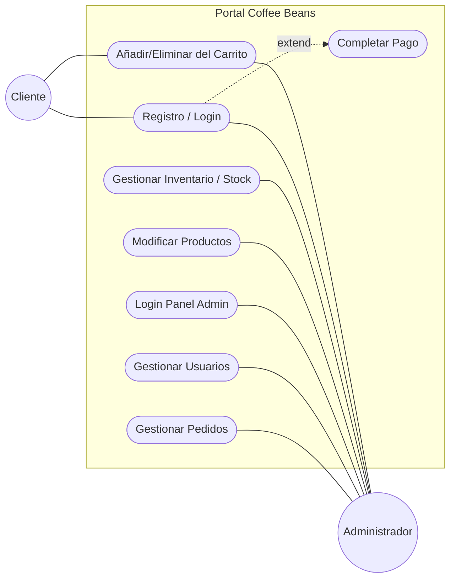

### 2.2. Especificación de Casos de Uso Principales e Interfaces

#### CU01: Gestión de Venta Manual (Administrador)
**Actor:** Administrador  
**Descripción:** Registro de ventas físicas con validación de stock en tiempo real.  
**Precondición:** Administrador autenticado en el backoffice.  
**Flujo principal:**
1. **Selección de Productos:** El administrador abre el modal de "Nueva Venta" y elige los productos.
2. **Validación de Stock:** El sistema valida que la cantidad solicitada no supere el stock actual.
3. **Selección de Cliente:** Se elige un usuario registrado de la lista desplegable.
4. **Confirmación:** Se confirma la operación, se descuenta el stock y se registra la venta.

**Postcondición:** Venta registrada y stock actualizado.  
**Interfaz:** Modal "Nueva Venta", buscadores de productos y clientes.  

**Alternativo:**
1. **Selección de Productos (Stock insuficiente):** El sistema detecta la falta de stock e informa: "Cantidad supera el stock disponible".
2. **Confirmación (Cliente No Seleccionado):** El sistema resalta el campo en rojo: "Debe seleccionar un cliente antes de confirmar".
3. **Proceso de Venta (Error de Conexión):** Muestra aviso: "No se pudo procesar la venta, intente de nuevo".

**Interfaz:**
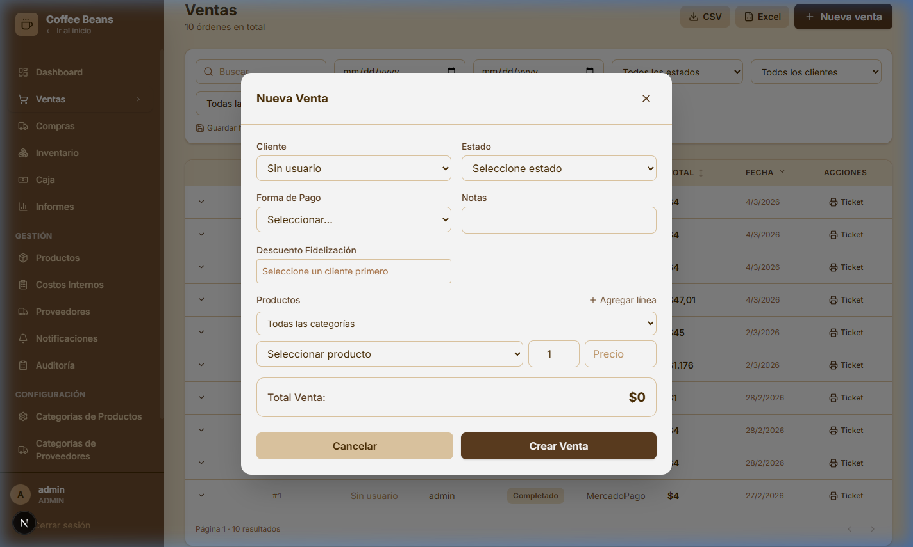

#### CU02: Administración de Catálogo y Recetas (BOM)
**Actor:** Administrador  
**Descripción:** Gestión centralizada de productos e insumos con filtros avanzados.  
**Precondición:** Acceso al panel de administración.  
**Flujo principal:**
1. **Acceso al Listado:** El administrador navega a la sección de productos.
2. **Filtrado y Búsqueda:** Aplica filtros por categoría o proveedor para localizar ítems.
3. **Edición:** Modifica precios, imágenes o visibilidad del producto.
4. **Guardado:** El sistema actualiza la base de datos y refleja los cambios en la web pública.

**Postcondición:** Catálogo actualizado para el cliente final.  
**Interfaz:** Tabla de productos, formularios de edición.  

**Alternativo:**
1. **Datos Inválidos (Precio):** Si se ingresa 0 o negativo, el sistema muestra: "El precio debe ser mayor a cero".
2. **Subida de Archivo (Imagen Pesada):** Si supera los 2MB, indica: "La imagen es demasiado grande".

**Interfaz:**
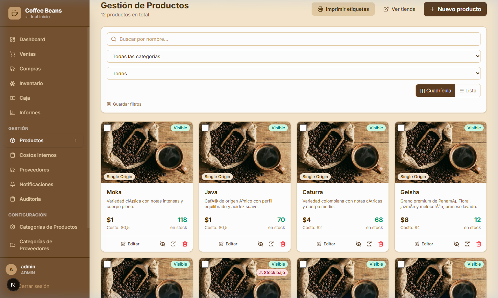

#### CU03: Control de Inventario Auditado
**Actor:** Administrador  
**Descripción:** Monitoreo de niveles de stock y ajustes manuales obligatorios.  
**Precondición:** Producto existente en el sistema.  
**Flujo principal:**
1. **Visualización de Niveles:** El admin revisa la tabla de inventario y alertas de stock mínimo.
2. **Selección de Ajuste:** Elige un producto para realizar entrada o salida manual.
3. **Registro de Motivo:** Ingresa cantidad y justificación del ajuste.
4. **Actualización:** El sistema impacta el stock y guarda el log de auditoría.

**Postcondición:** Stock corregido y auditado.  
**Interfaz:** Tabla de Auditoría/Inventario.  

**Alternativo:**
1. **Ingreso de Cantidad (Valor nulo):** Si no se ingresa un número, el sistema muestra: "Debe ingresar una cantidad válida".
2. **Confirmación de Ajuste (Sin motivo):** El sistema bloquea la acción e informa: "Debe indicar el motivo del ajuste".

**Interfaz:**
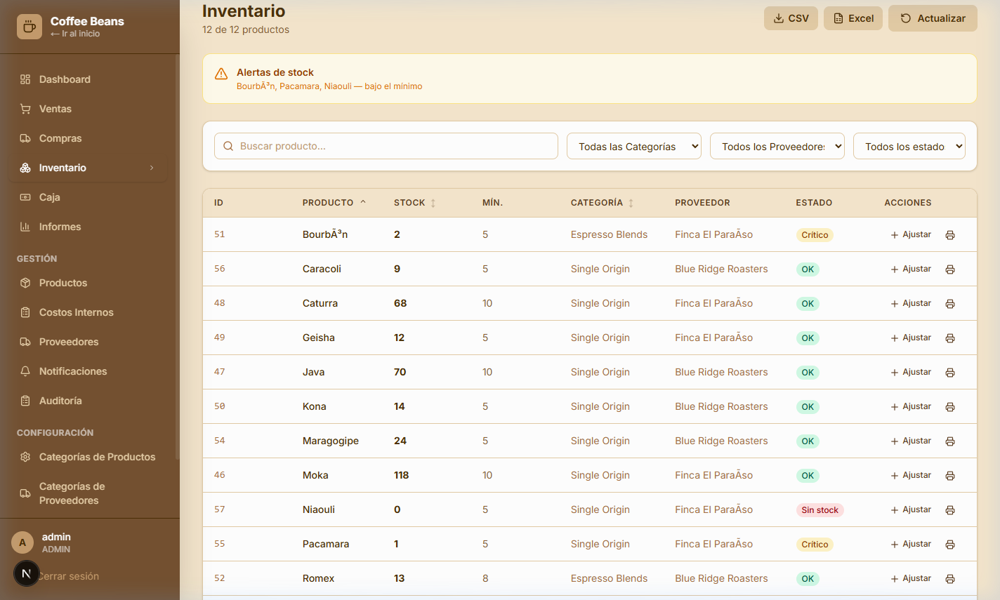

#### CU04: CRM y Gestión de Usuarios
**Actor:** Administrador  
**Descripción:** Administración de perfiles, puntos de fidelización y estados.  
**Precondición:** Administrador en sección "Clientes".  
**Flujo principal:**
1. **Consulta de Perfil:** Busca un usuario para ver su historial y puntos.
2. **Modificación de Estado:** Cambia el estado a "Inactivo" o "Activo".
3. **Gestión de Roles:** Asigna o quita privilegios de administrador.

**Postcondición:** Perfil de usuario actualizado.  
**Interfaz:** Tabla de Usuarios con toggle de estados.  

**Alternativo:**
1. **Cambio de Estado (Auto-Desactivación):** El sistema impide deshabilitar al admin en uso: "No puede cambiar su propio estado".
2. **Gestión de Roles (Sin Administrador):** El sistema bloquea el cambio si se intenta dejar el negocio sin admins: "Debe haber al menos un administrador activo".

**Interfaz:**
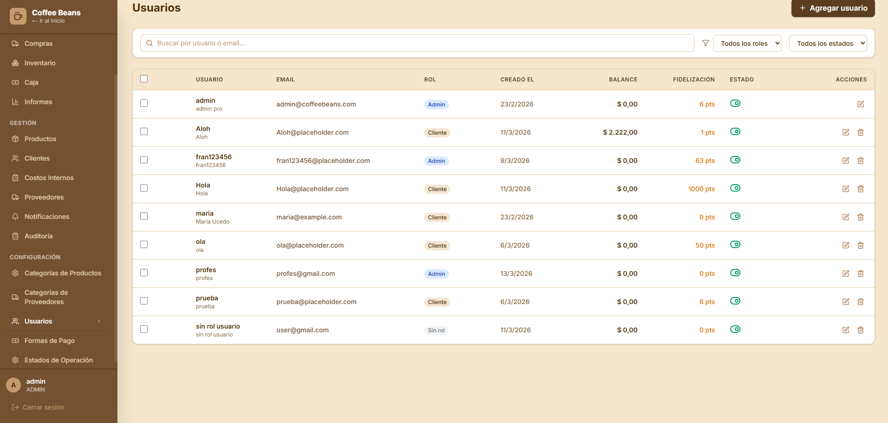

#### CU05: Venta Online y Checkout (MercadoPago)
**Actor:** Cliente  
**Descripción:** Flujo de compra completo en la web pública.  
**Precondición:** Usuario logueado y carrito con ítems.  
**Flujo principal:**
1. **Acceso a Checkout:** El cliente presiona "Pagar".
2. **Generación de Cobro:** El sistema crea la preferencia en MercadoPago.
3. **Proceso de Pago:** El usuario ingresa sus datos en la pasarela segura.
4. **Confirmación y Retiro:** El sistema confirma la orden, vacía el carrito y notifica que el pedido está listo para ser retirado en el local de forma inmediata.

**Postcondición:** Orden de venta generada.  
**Interfaz:** Carrito de compras, pasarela MercadoPago.  

**Alternativo:**
1. **Proceso de Cobro (Pago Rechazado):** Si la pasarela falla, el sistema muestra: "Tarjeta rechazada" y permite intentar con otro medio.
2. **Checkout (Sesión Expirada):** Si el token JWT venció, redirige al login indicando: "Su sesión ha expirado".
3. **Confirmación (Stock Agotado):** Si el stock cambia durante el pago, informa: "Ítem ya no disponible" y cancela la orden.

**Interfaz:**
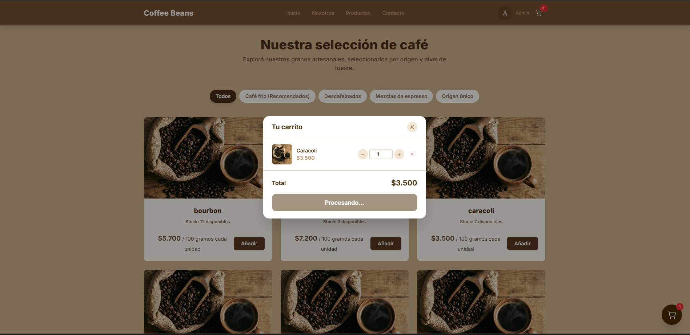
> [!NOTE]
> Proceso de pago integrado con MercadoPago (Sandbox)

#### CU06: Gestión de Compras e Insumos
**Actor:** Administrador  
**Descripción:** Registro de órdenes de compra a proveedores externos.  
**Precondición:** Proveedor registrado.  
**Flujo principal:**
1. **Inicio de Orden:** Selecciona proveedor y fecha de compra.
2. **Carga de Ítems:** Ingresa costos y cantidades de los suministros recibidos.
3. **Confirmación:** Al finalizar, el sistema aumenta el stock de los productos/insumos automáticamente.

**Postcondición:** Stock de insumos incrementado.  
**Interfaz:** Formulario de "Compras".  

**Alternativo:**
1. **Selección de Proveedor (Inactivo):** El sistema oculta o bloquea proveedores deshabilitados: "Proveedor no habilitado para compras".
2. **Carga de Costos (Cero/Nulo):** El sistema exige el valor de compra: "El costo unitario es obligatorio".

**Interfaz:**

#### CU07: Storefront - Navegación y Carrito
**Actor:** Cliente  
**Descripción:** Interfaz pública de consulta y compra.  
**Precondición:** Acceso a la URL del sitio.  
**Flujo principal:**
1. **Exploración:** Navega el catálogo con scroll infinito o paginación.
2. **Filtrado:** Usa la barra lateral para buscar cafés específicos.
3. **Adición:** Agrega productos al carrito flotante.

**Postcondición:** Productos listos para checkout.  
**Interfaz:** Catálogo público y Carrito.  

**Alternativo:**
1. **Consulta de Catálogo (Sin Stock):** El botón de compra se deshabilita y muestra la etiqueta: "Sin Stock" en rojo.
2. **Filtros (Sin Resultados):** El sistema informa al usuario: "No encontramos productos para esta categoría".

**Interfaz:**
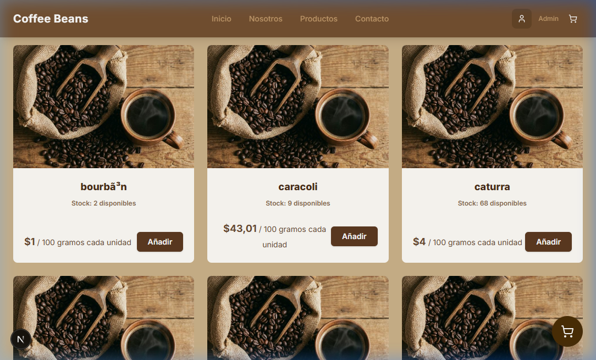

#### CU08: Dashboard y Análisis de Reportes (Administrador)
**Actor:** Administrador  
**Descripción:** Visualización de métricas y KPIs.  
**Precondición:** Ventas registradas en el sistema.  
**Flujo principal:**
1. **Consulta de Dashboard:** El admin entra a la sección de analítica.
2. **Filtrado de Fechas:** Selecciona el rango (hoy, semana, mes).
3. **Análisis:** Revisa el ticket promedio y el total de ingresos.

**Postcondición:** Información estratégica visualizada.  
**Interfaz:** Gráficos y tarjetas de KPI.  

**Alternativo:**
1. **Filtro de Calendario (Rango Inválido):** Si la fecha final es previa a la inicial, el sistema bloquea la búsqueda y muestra la advertencia.
2. **Gráficos (Sin Operaciones):** Si no hay ventas registradas, muestra un marcador de posición: "Sin datos para el periodo seleccionado".

**Interfaz:**
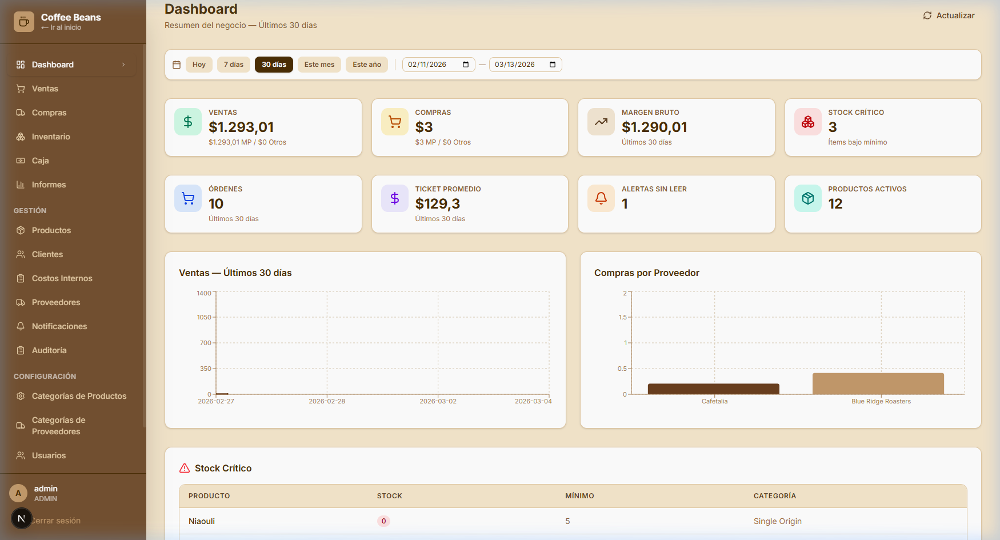

#### CU09: Sección Institucional y Contacto
**Actor:** Cliente / Administrador  
**Descripción:** Página informativa "Quiénes Somos" y formulario de contacto.  
**Precondición:** Sitio web visible públicamente.  
**Flujo principal:**
1. **Navegación:** El usuario accede a "Nosotros" para conocer la historia de la marca.
2. **Contacto:** Dirige al formulario de contacto, ingresa datos y mensaje.
3. **Envío:** El sistema valida los campos y confirma la recepción de la consulta.

**Alternativo:**
1. **Formulario incompleto:** El usuario intenta enviar sin completar campos obligatorios, el sistema resalta los errores.
2. **Error de red:** El envío falla por problemas de conectividad, se notifica al usuario.

**Postcondición:** Mensaje de contacto enviado al administrador.  
**Interfaz:**
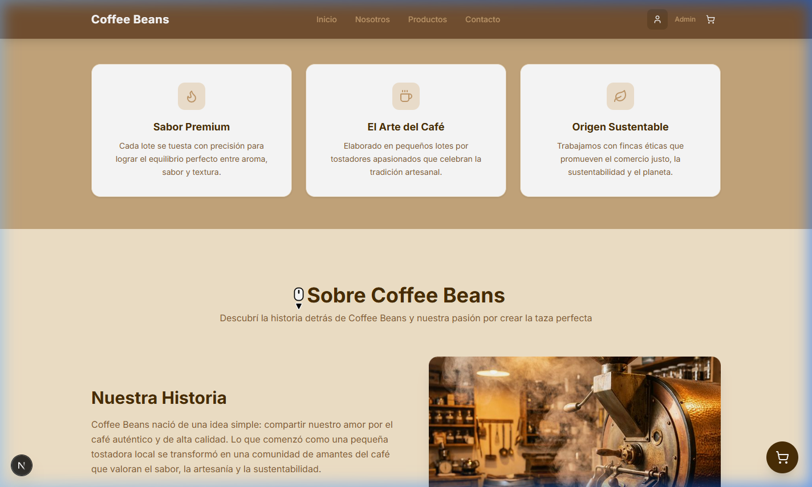

#### CU10: CRM - Historial de Compras de Clientes
**Actor:** Administrador  
**Descripción:** Consulta detallada de la actividad histórica de un cliente específico.  
**Precondición:** Cliente con operaciones registradas.  
**Flujo principal:**
1. **Selección de Cliente:** El admin busca un cliente en el panel CRM.
2. **Acceso a Historial:** Abre la pestaña de "Historial de Compras".
3. **Detalle:** Visualiza todas las órdenes pasadas, montos y estados de cada transacción.

**Alternativo:**
1. **Sin historial:** Si el cliente no tiene órdenes, se muestra: "Este cliente todavía no realizó compras".
2. **Error de carga:** El sistema no puede recuperar el historial, muestra: "Error al cargar la actividad del cliente".

**Postcondición:** Auditoría de comportamiento de compra visualizada.  
**Interfaz:**
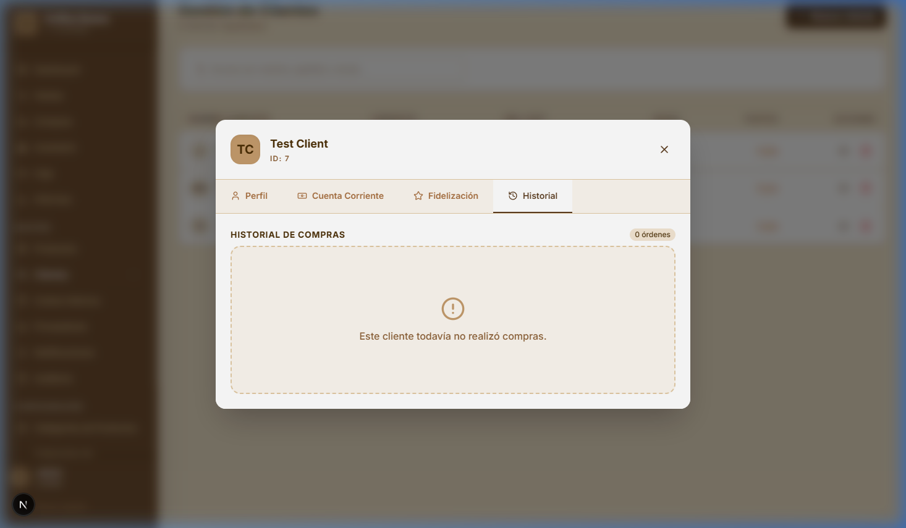

#### CU11: Registro de Usuarios
**Actor:** Cliente  
**Descripción:** Creación de una cuenta nueva para acceder a compras online.  
**Precondición:** Cliente no autenticado.  
**Flujo principal:**
1. **Acceso:** El usuario selecciona "Registrarse" en el navbar.
2. **Datos:** Completa formulario con nombre, email y contraseña.
3. **Procesamiento:** El sistema cifra la clave y crea el perfil de cliente asociado.

**Alternativo:**
1. **Email duplicado:** Si el correo ya existe, muestra: "El correo electrónico ya se encuentra registrado".
2. **Claves no coinciden:** El sistema valida la segunda clave e informa la discrepancia.

**Postcondición:** Usuario registrado con rol "CLIENTE".  
**Interfaz:**
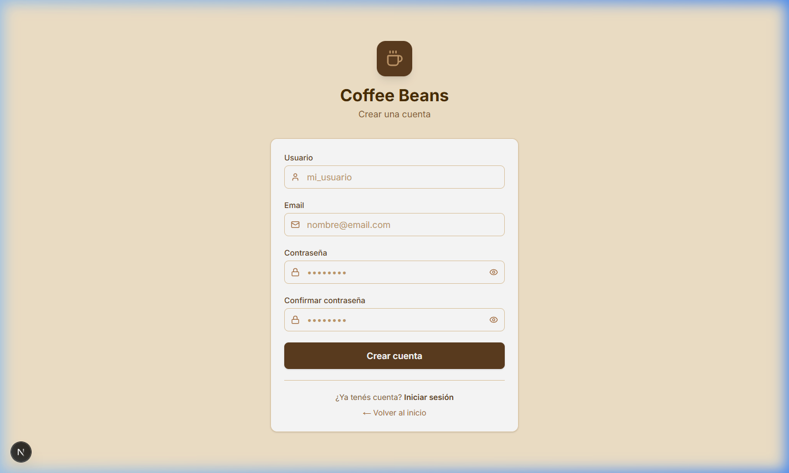

#### CU12: Autenticación y Login
**Actor:** Cliente / Administrador  
**Descripción:** Validación de credenciales para acceso al sistema.  
**Precondición:** Cuenta previamente creada.  
**Flujo principal:**
1. **Ingreso:** El usuario ingresa email y contraseña.
2. **Validación:** El backend verifica las credenciales vía Spring Security.
3. **JWT:** El servidor emite un token JWT de sesión.

**Alternativo:**
1. **Datos incorrectos:** Muestra: "Credenciales de acceso inválidas".
2. **Cuenta inactiva:** Si el usuario fue dado de baja, informa: "Su cuenta se encuentra deshabilitada".

**Postcondición:** Acceso concedido según el rol.  
**Interfaz:**
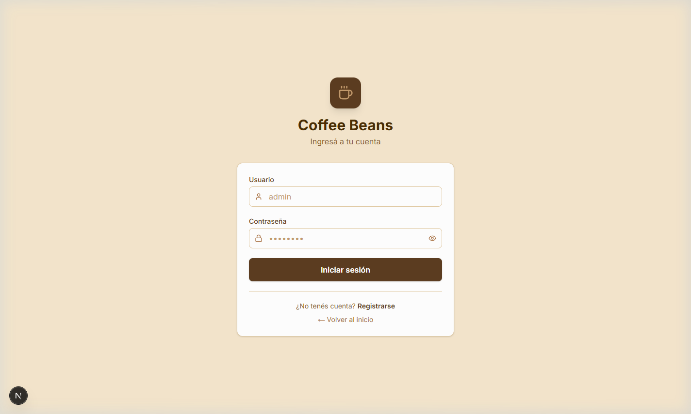

### 2.3. Diagrama de Clases (Arquitectura Backend Central)

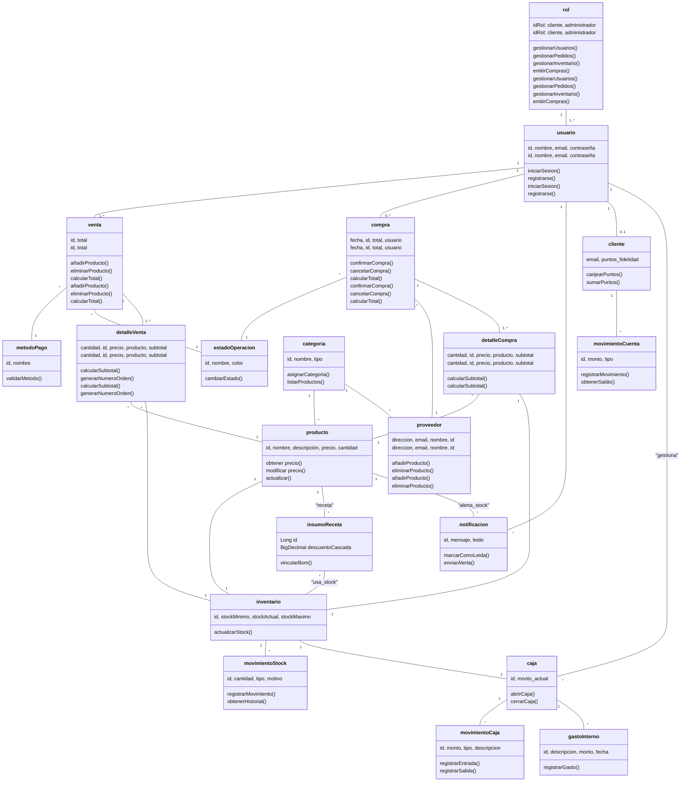

### 2.4. Diagrama de Implementación de Tablas (Modelo de Datos Físico/DER)

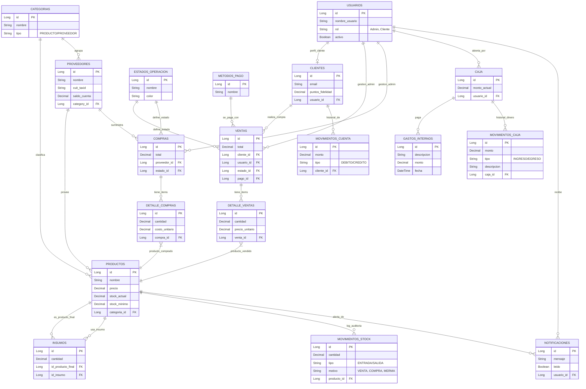

> [!NOTE]
> **Sobre Roles y Estructura:** Se cumple con el requerimiento de tener la tabla **CLIENTES** separada para datos de fidelidad/compras. El acceso de **Administrador** no es una tabla, sino un rol dentro de **USUARIOS**.

### 2.5. Documentación de Pruebas y Validación (QA)

#### Escenario 1: Seguridad y Acceso (JWT)
*   **Caso de Prueba:** Verificación de autenticación con Token.
*   **Procedimiento:** Intento de acceso a `/api/admin/dashboard/kpi` sin cabeceras.
*   **Resultado de Prueba:** El sistema retorna `401 Unauthorized`.
*   **Estado:** **Aprobado**.

#### Escenario 2: Lógica de Negocio - Stock en Tiempo Real
*   **Caso de Prueba:** Integridad de movimientos en cascada (BOM).
*   **Procedimiento:** Realizar una venta de un producto compuesto y verificar reducción de insumos.
*   **Resultado de Prueba:** Se valida descuento proporcional basado en la receta.
*   **Estado:** **Aprobado**.

#### Escenario 3: Integración de Pagos - MercadoPago Sandbox
*   **Caso de Prueba:** Ciclo completo de pago exitoso.
*   **Procedimiento:** Simular compra con tarjeta de prueba en entorno Sandbox.
*   **Resultado de Prueba:** El sistema recibe notificación de aprobado, registra venta y vacía carrito.
*   **Estado:** **Aprobado**.

#### Escenario 4: UX/UI - Registro de Clientes
*   **Caso de Prueba:** Validación de duplicados y creación de perfil.
*   **Procedimiento:** Intentar registrar un email ya existente.
*   **Resultado de Prueba:** El sistema arroja error de validación y previene el duplicado.
*   **Estado:** **Aprobado**.

#### Escenario 5: Analítica - Filtros de Dashboard
*   **Caso de Prueba:** Consistencia de datos en reportes temporales.
*   **Procedimiento:** Filtrar por rango de fechas en el panel de administración.
*   **Resultado de Prueba:** Los KPI se recalculan dinámicamente según el periodo seleccionado.
*   **Estado:** **Aprobado**.

#### Escenario 6: Gestión de Stock Crítico - Alertas
*   **Caso de Prueba:** Activación de banderas de reposición.
*   **Procedimiento:** Reducir stock por debajo del valor mínimo configurado.
*   **Resultado de Prueba:** El sistema resalta automáticamente el ítem como "Stock Bajo".
*   **Estado:** **Aprobado**.

#### Escenario 7: Seguridad - Control de Estado de Usuario
*   **Caso de Prueba:** Restricción de acceso a cuentas inactivas.
*   **Procedimiento:** Desactivar usuario e intentar iniciar sesión.
*   **Resultado de Prueba:** Spring Security bloquea el acceso informando cuenta deshabilitada.
*   **Estado:** **Aprobado**.

#### Escenario 8: Integridad de Reportes - Consolidación de Ventas
*   **Caso de Prueba:** Sumatoria mixta (Manual + Online).
*   **Procedimiento:** Cruzar datos de venta física y e-commerce en el mismo día.
*   **Resultado de Prueba:** El Dashboard consolida correctamente ambos ingresos en el reporte global.
*   **Estado:** **Aprobado**.

#### Escenario 9: Reglas de Fidelización - Canje de Puntos
*   **Caso de Prueba:** Aplicación de descuentos por puntos acumulados.
*   **Procedimiento:** Aplicar puntos de un cliente frecuente en el proceso de pago.
*   **Resultado de Prueba:** El total se reduce proporcionalmente y los puntos se debitan del perfil.
*   **Estado:** **Aprobado**.

#### Escenario 10: Persistencia de Sesión - Carrito Persistente
*   **Caso de Prueba:** Recuperación de estado tras refresco o logout.
*   **Procedimiento:** Agregar productos, cerrar sesión y re-autenticarse.
*   **Resultado de Prueba:** El sistema restaura los ítems previos vinculados a la cuenta del usuario.
*   **Estado:** **Aprobado**.

#### Escenario 11: Robustez - Concurrencia en Venta Final
*   **Caso de Prueba:** Bloqueo de pago por falta de stock repentino.
*   **Procedimiento:** Simular dos compras simultáneas del último producto en stock.
*   **Resultado de Prueba:** El sistema valida stock segundos antes del cobro final y rechaza la transacción excedente.
*   **Estado:** **Aprobado**.

#### Escenario 12: Auditoría - Trazabilidad de Ajustes Manuales
*   **Caso de Prueba:** Registro detallado de movimientos (Log de Auditoría).
*   **Procedimiento:** Realizar un ajuste manual indicando motivo "Rotura / Daño".
*   **Resultado de Prueba:** Se verifica en la base de datos la creación del registro con timestamp y responsable.
*   **Estado:** **Aprobado**.

---

## 3. Informe Tecnológico

### 3.1. Arquitectura de Software
El sistema sigue una arquitectura de **Cliente-Servidor** desacoplada, donde el Frontend y el Backend se comunican exclusivamente a través de una API RESTful, permitiendo la evolución independiente de ambas partes.

### 3.2. Stack Tecnológico Detallado

#### Frontend (Presentación)
- **Next.js & React:** Utilizado para la construcción de una SPA (Single Page Application) reactiva con optimización de carga.
- **TypeScript:** Implementado para robustez y mantenibilidad mediante tipado estático a lo largo de todo el flujo de datos.
- **Tailwind CSS:** Framework de diseño basado en utilidades para garantizar una UI consistente y de alta velocidad de respuesta.

#### Backend (Lógica de Negocio)
- **Java 17 & Spring Boot:** Motor principal del sistema, aprovechando las capacidades del ecosistema Spring (Lombok, DevTools, Web).
- **Spring Security:** Framework de seguridad encargado de la interceptación de peticiones y validación de roles de acceso.
- **JWT (JSON Web Token):** Estándar abierto para la transmisión segura de información de usuario entre las partes, gestionando la persistencia de sesión sin dependencia de servidor.

#### Persistencia y Manejo de Datos
- **PostgreSQL:** Base de datos relacional elegida por su capacidad para manejar volúmenes de datos transaccionales con integridad referencial estricta.
- **Hibernate / JPA:** Capa de abstracción que facilita las consultas complejas y garantiza que la estructura de objetos Java coincida 1:1 con las tablas relacionales.

#### Integraciones Externas
- **MercadoPago SDK:** Integración de pasarela de pago para el procesamiento seguro de transacciones monetarias en tiempo real.

---

## 4. Propuesta de Mejora y Alcance del Sistema
Basado en la evolución del proyecto y los requerimientos del entorno profesional, se plantea la siguiente hoja de ruta para transformar el sistema en una herramienta integral de gestión (CRM/ERP).

### 4.1. Optimización de ABM y Datos
Se propone completar los ABM (Altas, Bajas y Modificaciones) con datos profesionales:
- **Proveedores**: Razón social, CUIT, teléfono y rubro.
- **Clientes**: Historial detallado y preferencias de consumo.
- **Operativa**: Estados de operación avanzados (Reservado, Cancelado, En Proceso).

### 4.2. Inteligencia de Negocio y Reportes
- **Dashboard Extendido**: Gráficos de evolución de margen y ventas por proveedor.
- **Explotación de Datos**: Identificación de productos que no rotan y franjas horarias críticas.
- **Exportación**: Generación de reportes automáticos en PDF y Excel para auditorías.

### 4.3. Funcionalidades Profesionales
- **Gastos Internos**: Módulo para registrar egresos por servicios o imprevistos.
- **Notificaciones**: Alertas internas por vencimiento de stock o pagos pendientes.
- **Fidelización**: Automatización completa del programa de puntos y descuentos por lealtad.

> [!IMPORTANT]
> **Concluisón:** Con estas mejoras, el sistema trasciende su función inicial de página web para convertirse en un motor de gestión completo (CRM/ERP liviano) capaz de soportar el crecimiento del negocio.
